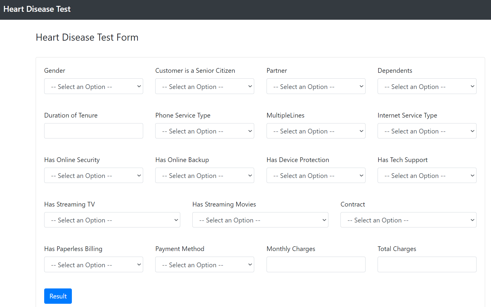

# Submission for Financier Take-Home Assignment

## About

`/notebook`: Contains `main.ipynb`, the file used to preprocess data, design and train the model on the dataset. The resulting model was pickled to `data/model.pkl`.

`app.py`: A Flask app that takes in user input, passes the data into the model and decides whether or not the customer is likely to default or not.

## Instructions

In order to run this project, clone this project and run `docker-compose up -d` at the root folder.

Navigate in your browser to `localhost:5000` to view the app.

## Screenshots

## Justifications for Choices

Justifications were included in `main.ipynb` as comments, but placed in this README for convenience.

### Reasons for Data Cleaning & Preprocessing Choices

1. Data with missing values was dropped instead of imputing: Rows with NaN had very little information.
2. Outliers were not removed: The removal of outliers, even at a cutoff of >3 standard deviations, produced worse results during testing.
3. Numerical Encoding instead of one-hot encoding data: Cardinality of features is high, but the number of levels is low. Prevents high dimensionality.
4. SMOTE (Synthetic Minority Oversampling Technique) over Classic Oversampling: Increase in the variety of training examples.

### Reasons for Backpropagation on F1 Score Over Accuracy

1. The dataset is imbalanced. F1 score takes a balance of Model can simply always predict "No" and achieve approx. 74% accuracy.
2. Balances between Precision and Recall.
3. Accuracy is more useful when we want to maximize True Positives and True negatives.
4. F1 score is more important when we want to avoid False Negatives and False Positives.
5. For default prediction, mispredicting a good customer as one which will default hurts the company's bottom line, and mispredicting a defaulting customer as a good customer results in additional losses for the company.
